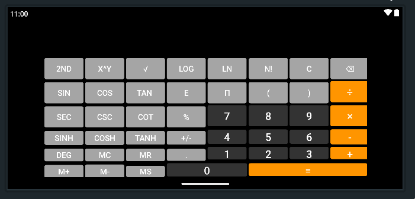
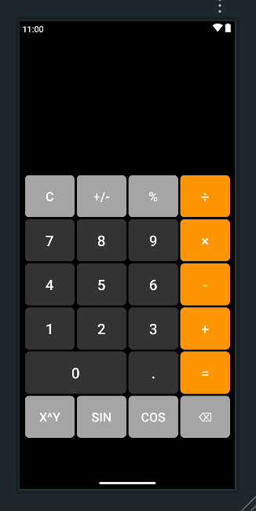

# Scientific Calculator for Android 📱🧮

[](https://opensource.org/licenses/MIT)

A dual-mode scientific calculator application for Android with basic and advanced mathematical operations, supporting both portrait and landscape orientations.

 

## Table of Contents
- [Features](#features-)
- [Installation](#installation-)
- [Usage](#usage-)
- [Technologies Used](#technologies-used-)
- [Contributing](#contributing-)
- [License](#license-)

## Features ✨

### Basic Operations
- Arithmetic operations (+, -, ×, ÷)
- Decimal point support
- Sign toggle (±)
- Percentage calculations
- Memory functions (MC, MR, MS, M+, M-)
- Clear and backspace operations

### Scientific Functions
- **Trigonometric Functions**
  - sin, cos, tan
  - sec, csc, cot
  - sinh, cosh, tanh
- **Logarithmic Functions**
  - log (base 10)
  - ln (natural log)
- **Advanced Operations**
  - Power (x^y)
  - Square root
  - Factorials (n!)
  - Constants (π, e)
- **Special Features**
  - Degree/Radian mode toggle
  - Secondary function layer
  - Parentheses support
  - Real-time input validation

## Installation ⚙️

### Prerequisites
- Android Studio (Arctic Fox or later)
- Android SDK 28+
- Java JDK 11+
- Android device/emulator with API 21+

### Steps
1. Clone the repository:
   ```bash
   git clone https://github.com/HaroonKhalid222/Scientific-Calculator-Android-Java.git
   
